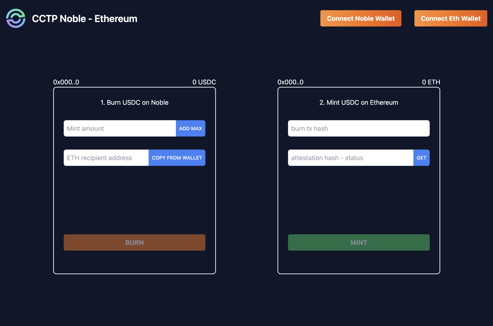
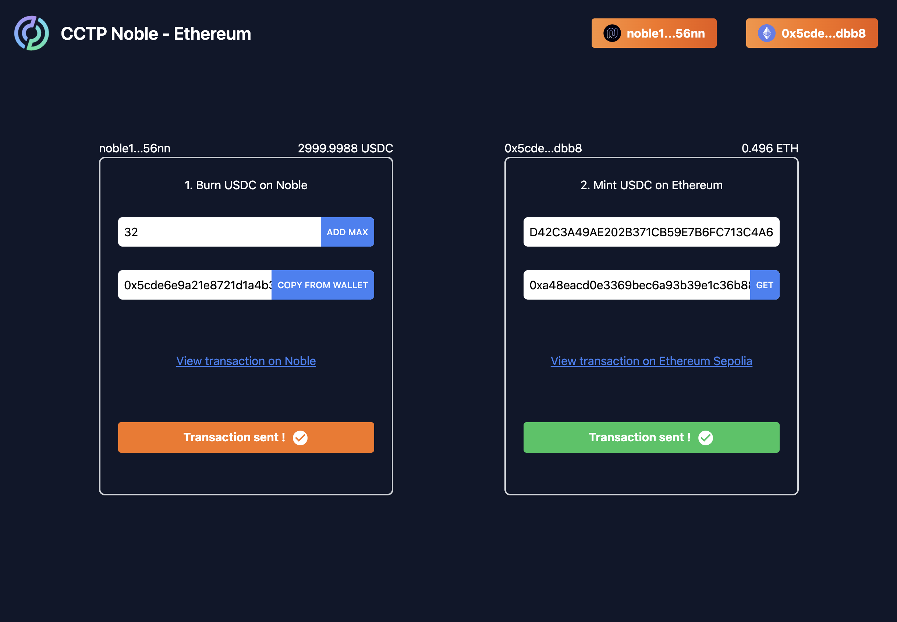

# CCTP Noble -> USDC

This project is a simple React app that allows users to transfer USDC from the Noble test chain to the Ethereum Sepolia
test chain. The app uses the CCTP (Circle Cross-Chain Transfer Protocol) developed by Circle to burn USDC on Noble and
mint them on Ethereum.

## Features

- Connect / disconnect his Keplr wallet
- See his USDC balance on Noble
- Connect / disconnect his Sepolia wallet with metamask
- See his balance on Sepolia
- Burn USDC on Noble
- Mint USDC on Ethereum Sepoli

## Installation

1. Clone the repository:

```bash
 git clone https://github.com/your-username/usdc-bridge.git
```

2. Install the dependencies:

```bash
bun install
```

3. Set up environment variables:
   Create a .env file in the root directory of the project and add the following variables:

```bash
VITE_MNEMONIC_KEPLR=<your Keplr mnemonic>

VITE_CONTRACT_ADDRESS="0x7865fAfC2db2093669d92c0F33AeEF291086BEFD"

VITE_INFURA_API_KEY=<your INFURA API key>

```

4. Start the development server:

```bash
bun run dev
```

The app will be available at http://localhost:5173.

## Wireframe and video

Here is a wireframe of what the UI could look like:
<a href="https://drive.google.com/file/d/1XVeoHA82eYgT8yokLGOWQUM40WOOrXZl/view?usp=sharing" target="_blank">Video demo
app</a>




## How to use it ?

### 1. Connect to metatmask and connect to sepolia testnet.

You can download metamask here :
https://metamask.io/

Here the rpc url :
https://sepolia.infura.io/v3/

### 2. Install keplr and connect to Noble testnet GRAND :

You can download keplr here :
https://www.keplr.app/

Here the rpc url :
https://chains.keplr.app/

### Mint and Burn

You should see your address and your balance from your wallets in top of both forms. (Mint and Burn)

#### Burn Form

    1. Enter a burn amount or click on ADD MAX button
    
    2. Enter your ETH address or click on COPY FROM WALLET BUTTON

    3. Click on Burn button
    
    4. If success, you should see two links :
        - Noble transaction on mintscan

#### Mint Form

    1. Get your tx hash created by clicking on the Noble transaction link on mintscan
    
    2. Get your attestation hash by clicking on "GET" button. This will trigger a HTTP rquest on the circle API getMessage:
    url api : https://iris-api-sandbox.circle.com/v1/messages/{sourceDomainId}/{transactionHash}
    website url : https://developers.circle.com/stablecoins/reference/getmessages

⚠️ It may took a while before getting the attestation, you should trigger the GET api after waiting few minutes in order
to let circle process the attestation build. ⚠️

    3. Click on Mint button

    4. If success, you should see a link :
        - Ethereum transaction on etherscan

Now, you should see the transaction on etherscan sepolia on the following contract address :
https://sepolia.etherscan.io/address/0x7865fAfC2db2093669d92c0F33AeEF291086BEFD

## API Reference

#### Get attestations and message

```http
  GET https://iris-api-sandbox.circle.com/v1/messages/{sourceDomainId}/{transactionHash}

```

| Parameter         | Type     | Description                     |
|:------------------|:---------|:--------------------------------|
| `sourceDomain`    | `string` | **Required** : 4                |
| `transactionHash` | `string` | **Required** : mintscan tx hash |

## Tech Stack

- Bun
- Vite
- Typescript
- React
- Tailwind CSS
- Material ui
- CosmJS
- Ethers.js
- Web3.js
- Keplr Wallet
- Metamask

## Acknowledgements

- [Circle API getMessage](https://developers.circle.com/stablecoins/reference/getmessages)
- [Generate an Infura API KEY](https://app.infura.io/)
- [CosmJS Keplr integration](https://tutorials.cosmos.network/tutorials/7-cosmjs/4-with-keplr.html)
- [Metamask SDK](https://docs.metamask.io/wallet/how-to/use-sdk/javascript/react/)
- [Keplr dashboard](https://wallet.keplr.app/)
- [Noble documentation](https://docs.nobleassets.xyz/)
- [Circle documentation bridge Noble -> Ethereum](https://developers.circle.com/stablecoins/docs/transfer-usdc-on-testnet-from-noble-to-ethereum)


